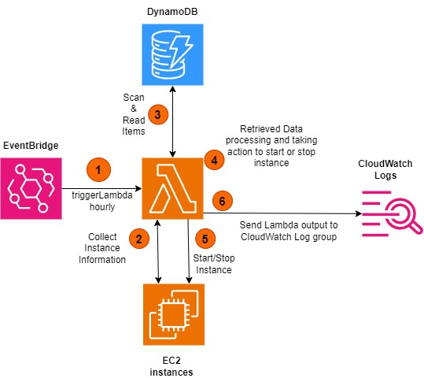

# EC2 scheduler



This project intention was to build PoC for EC2 Scheduler that allows for automated EC2 instances state management.

## Things to do before running Terraform workflow:

1) Navigate to folder /infra/state_configuration and edit values of file s3-state.hcl:
 ```terraform  
bucket = "dev-tf-state-bucket-XYZ"   << S3 with Name specified in this section must be configured first
key    = "state/ec2scheduler/terraform.tfstate"
region = "AWS-region"   << add region where S3 and DynamoDB are located
dynamodb_table = "terraform-lockid-table"  << modify name of dynamodb table used for locking purpose
```
2) Navigate to /infra/variables.tf file and modify variable default values or leave them as they are:

```terraform
variable "aws_region" {
  description = "Choosed AWS region to deploy infrastructure and backend"
  type        = string
  default     = "eu-central-1"  << can be updated
}

variable "environment" {
  description = "Name of your environment"
  type    = string
  default = "dev" << can be updated
}

variable "EventBridge_ScheduleName" {
  description = "Name of EventBridge Scheduler"
  type = string
  default = "checkEC2HourlyState-schedule" << can be updated
}

variable "aws_dynamoDB_tableName" {
    description = "Name of DynamoDB table"
    type = string
    default = "ec2-scheduler-table" << can be updated
}

variable "lambda_function_name" {
  description = "Name of Lambda Function"
  type = string
  default = "EC2SchedulerLambda" << can be updated
}
```
3) Navigate to /infra/dynamodb.tf and modify DynamoDB items if needed:

```terraform
resource "aws_dynamodb_table_item" "example" {
  table_name = aws_dynamodb_table.ec2-scheduler-table.name
  hash_key   = aws_dynamodb_table.ec2-scheduler-table.hash_key
  for_each = {
    "1" = {
      schedulerName = "dev"    << can be updated
      start_time = "9:00:00"   << can be updated
      stop_time = "17:00:00"   << can be updated
      weekdays = "mon-fri"     << can be updated

    }
    "2" = {
      schedulerName = "dev-schedule"  <<can be updated
      start_time = "9:00:00"          <<can be updated
      stop_time = "17:00:00"          <<can be updated
      weekdays = "mon-thu"            <<can be updated
    }
  }
  item = <<ITEM
    {
        "${aws_dynamodb_table.ec2-scheduler-table.hash_key}":{"N":"${each.key}"},
        "schedulerName": {"S": "${each.value.schedulerName}"},
        "start_time": {"S": "${each.value.start_time}"},
        "stop_time": {"S": "${each.value.stop_time}"},
        "weekdays": {"S": "${each.value.weekdays}"}
    }
    ITEM
}
```

